<!-- PROJECT LOGO -->
<br />
<div align="center">
  <a href="https://github.com/othneildrew/Best-README-Template">
    
  </a>
  <p align="center">
    <a href="">View Demo</a>
    ·
    <a href="https://github.com/ThanhDatVu111/Project-Rise/issues">Report Bug</a>
    ·
    <a href="https://github.com/ThanhDatVu111/Project-Rise/pulls">Request Feature</a>
  </p>
</div>

<!-- TABLE OF CONTENTS -->
<details>
  <summary>🗂️ Table of Contents</summary>
  <ol>
    <li><a href="#-about-the-project">About The Project</a>
      <ul>
        <li><a href="#-home-page">Home Page</a></li>
        <li><a href="#-sign-in">SignIn/SignUp Page</a></li>
        <li><a href="#-dash-board">Dashboard</a></li>
        <li><a href="#-create-new-course">Create New Course</a></li>
        <li><a href="#-course-detail">Course Detail</a></li>
      </ul>
    </li>
    <li><a href="#%EF%B8%8F-tech-stack">Tech Stack</a></li>
    <li><a href="#-getting-started">Getting Started</a>
      <ul>
        <li><a href="#-prerequisites">Prerequisites</a></li>
        <li><a href="#%EF%B8%8F-installation">Installation</a></li>
      </ul>
    </li>
    <li><a href="#-contributing">Contributing</a></li>
    <li><a href="#-license">License</a></li>
    <li><a href="#-contact">Contact</a></li>
  </ol>
</details>

<!-- ABOUT THE PROJECT -->
## 🚀 Home

Rise is a cutting-edge AI-powered Learning Management System (LMS) SaaS app built with Next.js. It empowers educators and learners with advanced functionalities designed to enhance and personalize the learning experience. The platform offers:

- 💡 Advanced AI capabilities for dynamic content generation.
- 🔐 Secure authentication powered by Clerk.
- 💳 Seamless payment processing with Stripe.
- ⚡ Efficient serverless functions using Inngest.
- 🗄️ Robust database management with Neon DB.
- 🎨 A modern, responsive UI built with React and Tailwind CSS.

### 🏠 Home Page

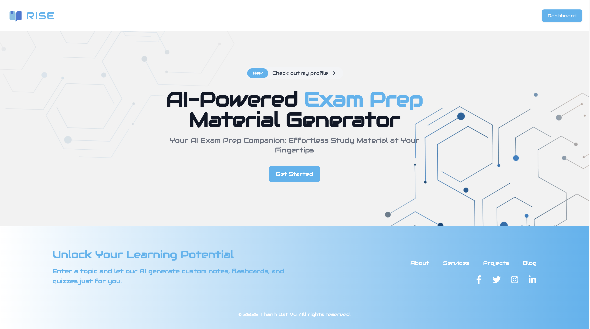

**Description:**  
The Home Page offers an intuitive dashboard with a modern layout that highlights key courses, features, and announcements. Users can easily navigate through different sections and quickly access the platform's main functionalities.


### SignIn / SignUp

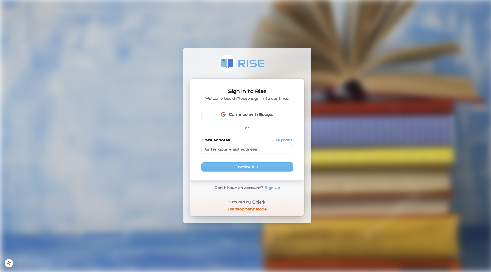

**Description:**  
The SignIn/SignUp page provides a secure and seamless authentication experience. New users can register effortlessly, while returning users enjoy a streamlined login process powered by Clerk.

### Dashboard

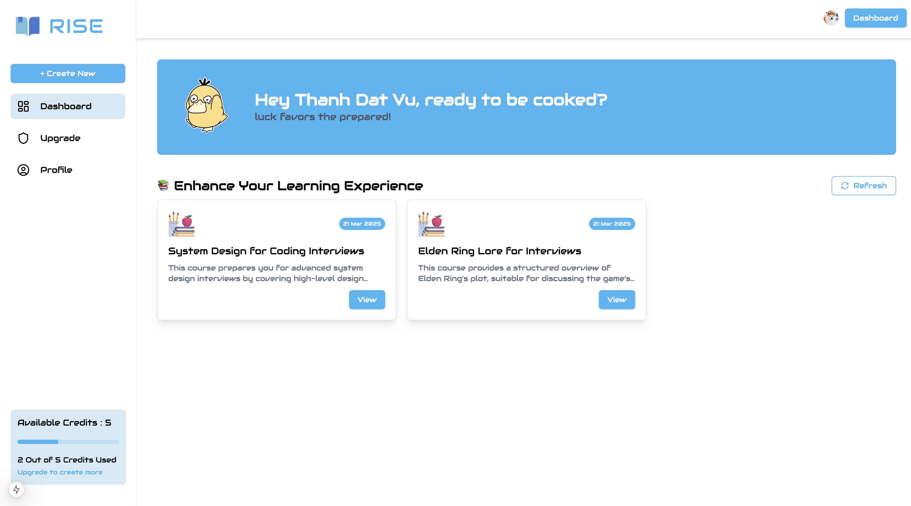

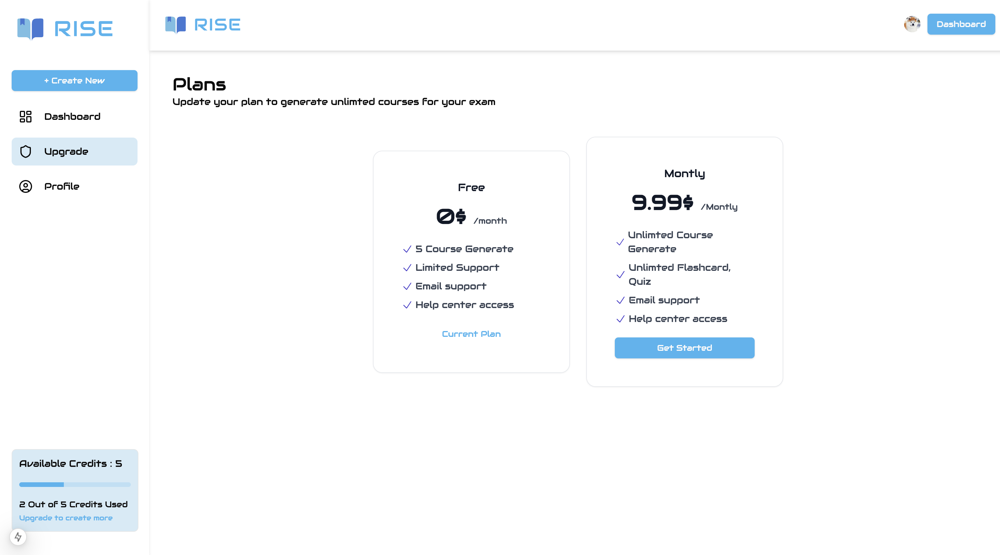

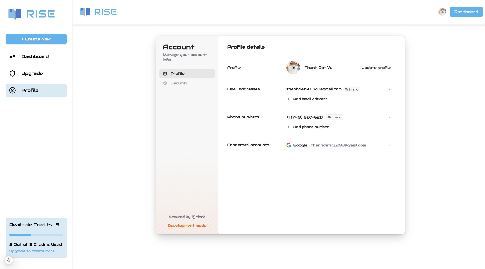

**Description:**  
The Dashboard serves as the central hub for users. It displays, course progress, option to view profile and upgrade tier and quick access to essential tools, allowing educators and learners to manage their activities effectively.

### 📝 Create New Course

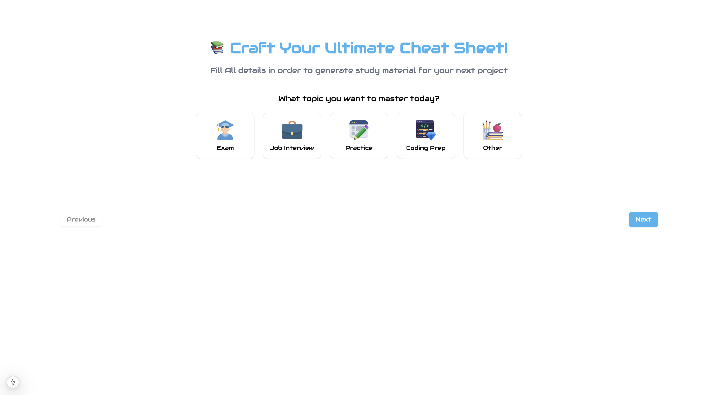

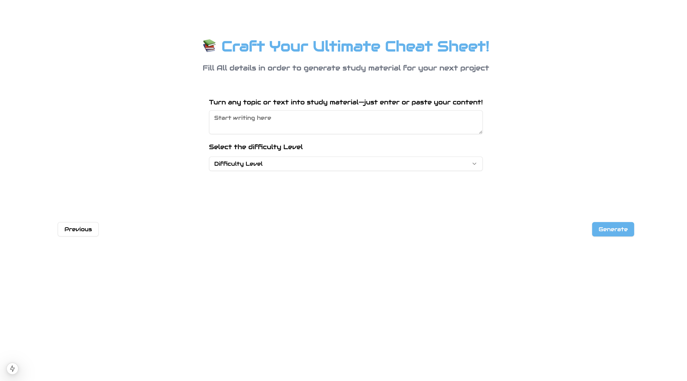

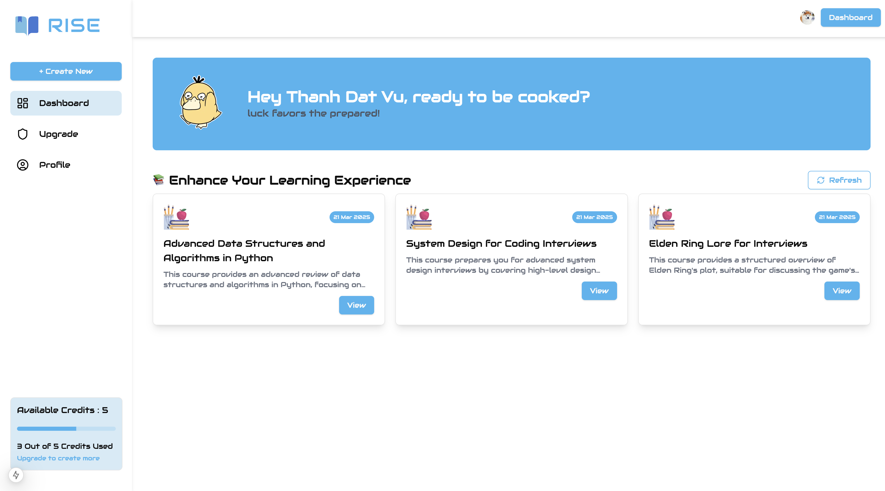

**Description:**  
This process allows educators to create new courses. The interface is designed for simplicity, enabling users to input course details, and configure course settings with ease.

### 📝 Course Detail

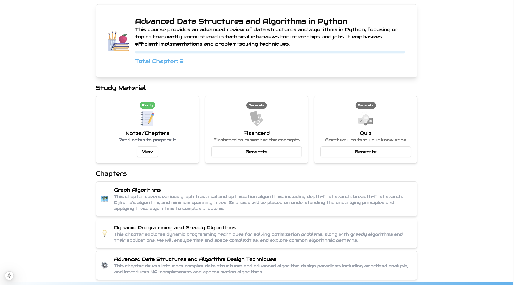

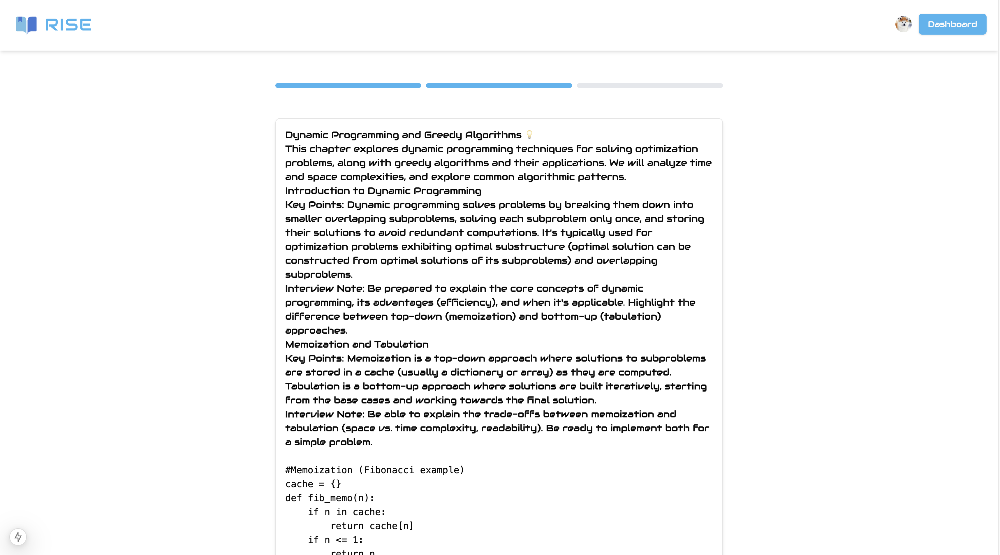

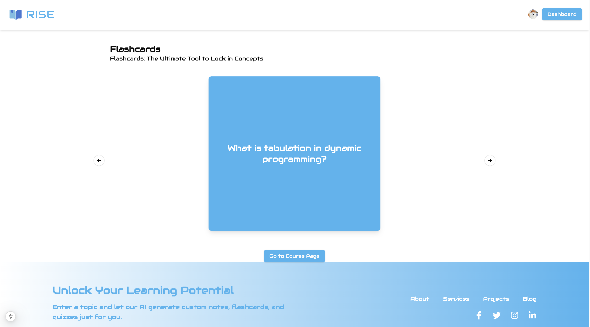

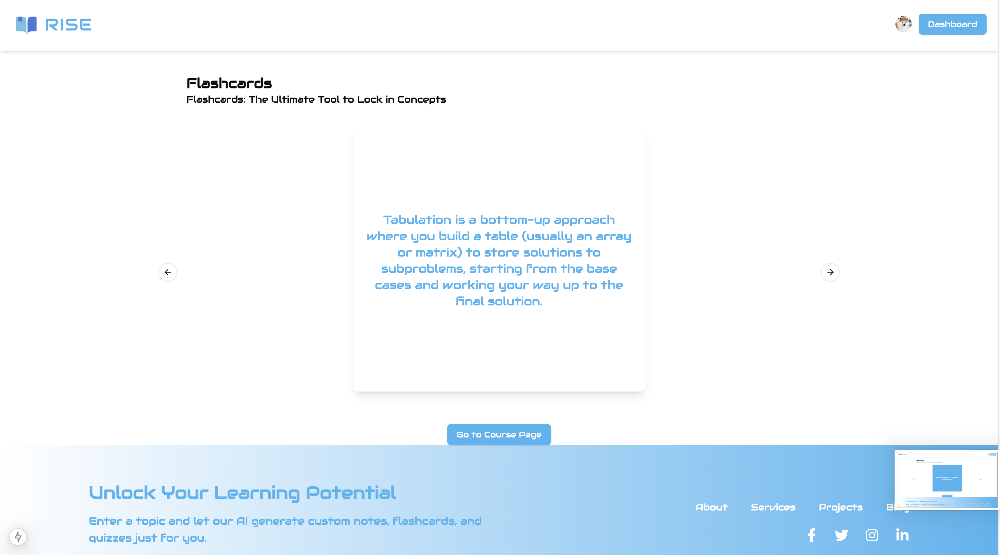

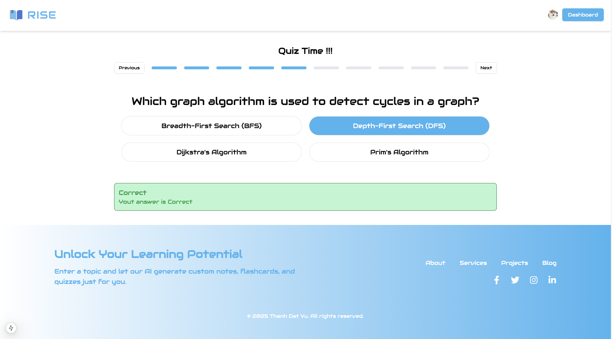

**Description:**  
The Course Detail page provides a comprehensive view of the course content, including:

- **Study Material**: Quick access to chapters, flashcards, and quizzes.  
- **Chapters Overview**: A list of chapters with descriptions and key highlights.  
- **AI-Generated Material**: Ability to generate notes, flashcards, and quizzes on demand.  
- **Progress Tracking**: See how many chapters are available and monitor completion.  
- **Interactive Learning**: Engage with in-depth explanations, coding examples, and problem-solving techniques.


<p align="right">(<a href="#readme-top">back to top</a>)</p>

## 🛠️ Tech Stack

This project is built using modern technologies to ensure performance and scalability.

### Frontend
[![Next.js][Next.js]][Next-url]
[![React][React.js]][React-url]
[![Tailwind CSS][Tailwind.css]][Tailwind-url]
[![Radix UI][Radix.ui]][Radix-url]
[![Framer Motion][Framer-motion]][Framer-motion-url]
[![Lucide React][Lucide.react]][Lucide-url]

### Backend & Services
[![Inngest][Inngest]][Inngest-url]
[![Neon Database][Neon.tech]][Neon-url]
[![Drizzle ORM][Drizzle.orm]][Drizzle-url]
[![Stripe][Stripe]][Stripe-url]
[![Google Generative AI][Google.ai]][Google.ai-url]

### Authentication
[![Clerk][Clerk.dev]][Clerk-url]

### Additional Libraries
[![Axios][Axios]][Axios-url]
[![clsx][clsx]][clsx-url]
[![date-fns][date-fns]][date-fns-url]

### Tooling & Utilities
[![ESLint][ESLint.com]][ESLint-url]
[![Drizzle Kit][Drizzle.kit]][Drizzle-url]
[![Tailwind Merge][Tailwind.merge]][Tailwind-merge-url]
[![tailwindcss-animate][Tailwind-animate]][Tailwind-animate-url]
[![uuidv4][uuidv4]][uuidv4-url]

<!-- MARKDOWN LINKS & BADGES -->
[Next.js]: https://img.shields.io/badge/Next.js-000000?style=for-the-badge&logo=nextdotjs&logoColor=white
[Next-url]: https://nextjs.org/

[React.js]: https://img.shields.io/badge/React-20232A?style=for-the-badge&logo=react&logoColor=61DAFB
[React-url]: https://reactjs.org/

[Tailwind.css]: https://img.shields.io/badge/Tailwind_CSS-38B2AC?style=for-the-badge&logo=tailwind-css&logoColor=white
[Tailwind-url]: https://tailwindcss.com/

[Radix.ui]: https://img.shields.io/badge/Radix_UI-292D3E?style=for-the-badge&logo=radix-ui&logoColor=white
[Radix-url]: https://www.radix-ui.com/

[Framer-motion]: https://img.shields.io/badge/Framer_Motion-0055FF?style=for-the-badge&logo=framer&logoColor=white
[Framer-motion-url]: https://www.framer.com/motion/

[Lucide.react]: https://img.shields.io/badge/Lucide_React-gray?style=for-the-badge
[Lucide-url]: https://lucide.dev/

[Inngest]: https://img.shields.io/badge/Inngest-3E4FF7?style=for-the-badge
[Inngest-url]: https://www.inngest.com/

[Neon.tech]: https://img.shields.io/badge/Neon-000000?style=for-the-badge&logo=postgresql&logoColor=white
[Neon-url]: https://neon.tech/

[Drizzle.orm]: https://img.shields.io/badge/Drizzle_ORM-C5F74F?style=for-the-badge&logo=drizzle&logoColor=black
[Drizzle-url]: https://orm.drizzle.team/

[Stripe]: https://img.shields.io/badge/Stripe-008CDD?style=for-the-badge&logo=stripe&logoColor=white
[Stripe-url]: https://stripe.com/

[Google.ai]: https://img.shields.io/badge/Google_Generative_AI-4285F4?style=for-the-badge&logo=google&logoColor=white
[Google.ai-url]: https://developers.generativeai.google/

[Clerk.dev]: https://img.shields.io/badge/Clerk-6C47FF?style=for-the-badge&logo=clerk&logoColor=white
[Clerk-url]: https://clerk.com/

[Axios]: https://img.shields.io/badge/Axios-5A29E4?style=for-the-badge&logo=axios&logoColor=white
[Axios-url]: https://axios-http.com/

[clsx]: https://img.shields.io/badge/clsx-lightgrey?style=for-the-badge
[clsx-url]: https://www.npmjs.com/package/clsx

[date-fns]: https://img.shields.io/badge/date--fns-5093E1?style=for-the-badge
[date-fns-url]: https://date-fns.org/

[ESLint.com]: https://img.shields.io/badge/ESLint-4B32C3?style=for-the-badge&logo=eslint&logoColor=white
[ESLint-url]: https://eslint.org/

[Drizzle.kit]: https://img.shields.io/badge/Drizzle_Kit-C5F74F?style=for-the-badge&logo=drizzle&logoColor=black
[Drizzle-url]: https://orm.drizzle.team/kit-docs/overview

[Tailwind.merge]: https://img.shields.io/badge/Tailwind_Merge-38B2AC?style=for-the-badge&logo=tailwindcss&logoColor=white
[Tailwind-merge-url]: https://www.npmjs.com/package/tailwind-merge

[Tailwind-animate]: https://img.shields.io/badge/tailwindcss--animate-38B2AC?style=for-the-badge&logo=tailwindcss&logoColor=white
[Tailwind-animate-url]: https://github.com/andrew--r/tailwindcss-animatecss

[uuidv4]: https://img.shields.io/badge/uuidv4-35495E?style=for-the-badge
[uuidv4-url]: https://www.npmjs.com/package/uuidv4

<p align="right">(<a href="#readme-top">back to top</a>)</p>

<!-- GETTING STARTED -->

## 🚀 Getting Started

This is an example of how you may give instructions on setting up your project locally.
To get a local copy up and running follow these simple example steps.

### 📋 Prerequisites

- Node.js (v16.0.0 or higher)
- npm (v7.0.0 or higher)
- Git

### Installation

Below is an example of how you can instruct your audience on installing and setting up your app. This template doesn't rely on any external dependencies or services._

1. Clone the repo

   ```sh
    git clone https://github.com/ThanhDatVu111/Vroom-Vroom.git
    cd Vroom-Vroom
   ```

2. Install NPM packages

   ```sh
   npm install
   ```

3. Set up your key

   ```js
    NEXT_PUBLIC_CLERK_PUBLISHABLE_KEY=your_clerk_key
    NEXT_PUBLIC_DRIZZLE_DATABASE_URL=your_neon_database_url
    VITE_FIREBASE_API_KEY=your_firebase_key
    VITE_SENDBIRD_APP_ID=your_sendbird_app_id
    VITE_SENDBIRD_API_TOKEN=your_sendbird_token
    NEXT_PUBLIC_DATABASE_CONNECTION_STRING=your_database_connection_string
    CLERK_SECRET_KEY=your_clerk_secret_key
    NEXT_PUBLIC_CLERK_SIGN_IN_URL=your_sign_in_url
    NEXT_PUBLIC_CLERK_SIGN_UP_URL=your_sign_up_url
    NEXT_PUBLIC_GEMINI_API_KEY=your_gemini_api_key
    STRIPE_SECRET_KEY=your_stripe_secret_key
    NEXT_PUBLIC_STRIPE_PRICE_ID=your_stripe_price_id
    HOST_URL=your_host_url
    STRIPE_WEB_HOOK_KEY=your_stripe_webhook_key

   ```

4. Set up your Database

   ```sh
    npm run db:generate  # Generate database schemas
    npm run db:push     # Push schemas to your database
   ```

5. Start the development server

   npm run dev

<p align="right">(<a href="#readme-top">back to top</a>)</p>

<!-- CONTRIBUTING -->

## 🤝 Contributing

Contributions are what make the open source community such an amazing place to learn, inspire, and create. Any contributions you make are **greatly appreciated**.

If you have a suggestion that would make this better, please fork the repo and create a pull request. You can also simply open an issue with the tag "enhancement".
Don't forget to give the project a star! Thanks again!

1. Fork the Project
2. Create your Feature Branch (`git checkout -b feature-name`)
3. Commit your Changes (`git commit -m 'Add some feature'`)
4. Push to the Branch (`git push origin feature-name`)
5. Open a Pull Request

<!-- LICENSE -->

## 📜 License

Distributed under the MIT License. See `LICENSE.txt` for more information.

<p align="right">(<a href="#readme-top">back to top</a>)</p>

<!-- CONTACT -->

## 📧 Contact

Thanh Dat Vu - [LinkedIn](https://www.linkedin.com/in/thanhdatvu111) - thanhdatvu.203@gmail.com

Project Link: [https://github.com/ThanhDatVu111/Vroom-Vroom](https://github.com/ThanhDatVu111/Vroom-Vroom)

<p align="right">(<a href="#readme-top">back to top</a>)</p>